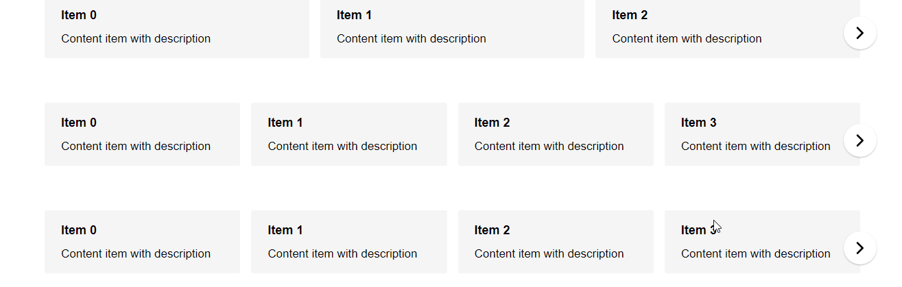

<h1 align="center">👋 vue-horizontal-list-autoscroll 🕶</h1>
<h3 align="center">
  
  <a href="https://github.com/MiKr13/S3-Bucket-Download/#README" target="_blank">
    
  </a>
  <a href="#" target="_blank">
    
  </a>
  <a href="https://www.npmjs.com/package/vue-horizontal-list-autoscroll" target="_blank">
                                           
  </a>
  <a href="https://twitter.com/mikr1306" target="_blank">
    
  </a>
  <a href="https://github.com/mikr13" target="_blank">
                                           
  </a>
</h3>

A pure vue horizontal list implementation with minimal dependencies, ssr support, mobile friendly, touch friendly and responsive now with auto scroll

This project is built on top of [vue-horizontal-list](https://github.com/fuxingloh/vue-horizontal-list), huge shout out to [Fuxing Loh](https://github.com/fuxingloh) for laying the groundwork, every other option and configuration available there is valid here also.

This project aim is to add support for:
* Autoscroll
* Autoscroll on different breakpoints (planned in 2.0.0)
* Vuetify (planned in 2.0.0)

## Demo
[](https://github.com/MiKr13/vue-horizontal-list-autoscroll)


## Installation
```shell script
npm i vue-horizontal-list-autoscroll
# or
yarn add vue-horizontal-list-autoscroll
```

## Features
* Lightweight implementation with 1 dependencies.
* SSR supported
* Mobile touch screen friendly
* Invisible scroll bar for consistent Windows and MacOS browsing experience.
* Autoscroll feature
* Snap to the nearest item in the horizontal-list when scrolling.
* Windowed & Full-screen mode
  * The windowed mode will respect the container and not show overflowing item
  * Full-screen mode will show overflowing item, best result for small screen
* Dynamic responsive breakpoint configuration
* Navigation control will show up dynamically for larger screen
* Touch screen friendly
* Minimal config setup
* Tested on chrome, edge and safari

## Options
```js
const options = {
  item: {
    // css class to inject into each individual item
    class: '',
    // padding between each item
    padding: 12 
  },
  autoscroll: {
    // auto scroll feature enabled or not
    enabled: true,
    // if enabled, the interval in seconds, by default 10 seconds
    interval: 15,
  }
  list: {
    // css class for the parent of item
    class: '', 
    // maximum width of the list it can extend to before switching to windowed mode, basically think of the bootstrap container max-width
    // windowed is used to toggle between full-screen mode and container mode
    windowed: 1200,
    // padding of the list, if container < windowed what is the left-right padding of the list
    // during full-screen mode the padding will added to left & right to centralise the item
    padding: 24
  },
  responsive: [
    // responsive breakpoints to calculate how many items to show in the list at each width interval
    // it will always fall back to these:
    {end: 576, size: 1},
    {start: 576, end: 768, size: 2},
    {start: 768, end: 992, size: 3},
    {start: 992, end: 1200, size: 4},
    {start: 1200, size: 5}
  ],
  navigation: {
    // when to show navigation
    start: 992,
    color: '#000'
  }
} 
```

## Examples

### Basic Responsive Usage
- Width between 0 - 576, show 1
- Width between 576 - 768, show 2
- Width catch all, show 3

```vue
<vue-horizontal-list-autoscroll :items="items" :options="{responsive: [{end: 576, size: 1}, {start: 576, end: 768, size: 2},{size: 3}], autoscroll:{ enabled: true }}">
  <template v-slot:default="{item}">
    <div class="item">
      <h5>{{item.title}}</h5>
      <p>{{item.content}}</p>
    </div>
  </template>
</vue-horizontal-list-autoscroll>
```

### Full Example
```vue
<template>
  <div id="app">
    <section>
      <vue-horizontal-list-autoscroll :items="items" :options="options">
        <template v-slot:default="{item}">
          <div class="item">
            <h5>{{item.title}}</h5>
            <p>{{item.content}}</p>
          </div>
        </template>
      </vue-horizontal-list-autoscroll>
    </section>
  </div>
</template>

<script>
  import Vue from 'vue';
  import VueHorizontalListAutoscroll from '@/vue-horizontal-list-autoscroll.vue';

  export default Vue.extend({
    name: 'ServeDev',
    components: {
      VueHorizontalListAutoscroll
    },
    data() {
      return {
        options: {
          responsive: [
            {end: 576, size: 1}, 
            {start: 576, end: 768, size: 2},
            {start: 768, end: 992, size: 3},
            {size: 4}
          ],
          autoscroll: {
            enabled: true,
            interval: 15
          },
          list: {
            // 1200 because @media (min-width: 1200px) and therefore I want to switch to windowed mode
            windowed: 1200,

            // Because: #app {padding: 80px 24px;}
            padding: 24
          }
        },  
        items: [
          {title: 'Item 0', content: 'Content item with description'},
        ]
      }
    }
  });
</script>

<style>
  body {
    margin: 0;
    padding: 0;
  }

  #app {
    max-width: 1400px;

    margin-left: auto;
    margin-right: auto;

    padding: 80px 24px;
  }

  @media (min-width: 1200px) {
    #app {
      padding-left: 80px;
      padding-right: 80px;
    }
  }
</style>
```

## Contributing
For any question or feature request please feel free to create an [issue](https://github.com/MiKr13/vue-horizontal-list-autoscroll/issues/new) or [pull request](https://github.com/MiKr13/vue-horizontal-list-autoscroll/pulls).
